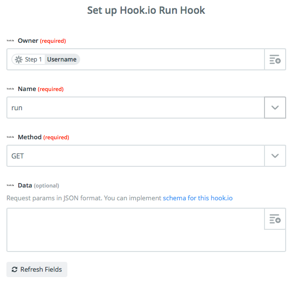
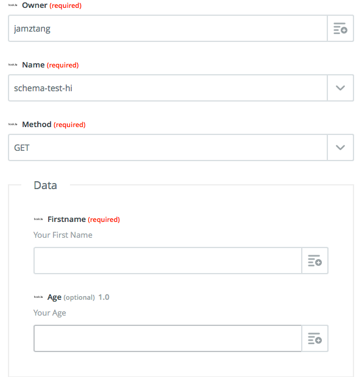

hook.io-zapier
--

Adds Hook.io to Zapier

https://zapier.com/developer/invite/54424/77f5e66713349a5fae36505bfa53d0b3/

## Triggers

- List APIs (hidden)

## Actions

- Run Hook

## Searches

none

---

### Bonus Part

By making use of hook.io's [mschema](https://github.com/mschema/mschema), we can actually use it for [Custom Action Fields](https://zapier.com/developer/documentation/v2/actions/#custom-action-fields-url) in Zapier.

However transformation is needed since the formatting in mschema is
slightly different than what Zapier requires. We're doing the
transformation in schema.js

| mschema | zapier  |
|---|---|
| string  | unicode |
| number  | decimal |

To test out the Custom Action Fields behaviour, try using the hook
[jamztang/schema-test-hi](http://hook.io/jamztang/schema-test-hi/_src)

